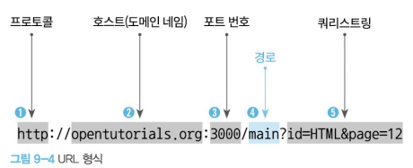
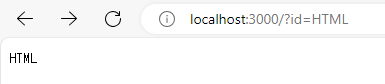
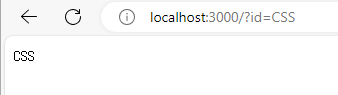
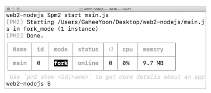
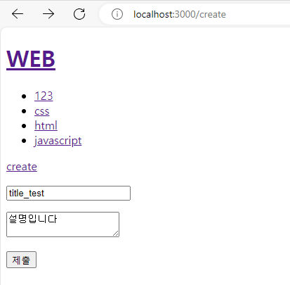
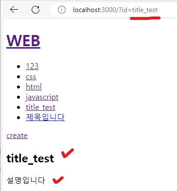
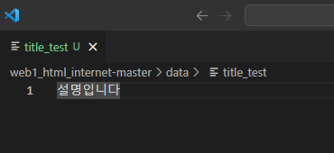

# NODE   
* node 출현 배경 : JS에 익숙한 웹 개발자들이 새로운 컴퓨터 언어를 배우지 않고도 웹 페이지를 자동으로 생성하는 서버 쪽 애플리케이션을 만들 수 있게 하고 싶어했다. 
* node.js 런타임 위에서 작동 => node.js 애플리케이션 / 자바 스크립트 / Node.js 런타임
* node 설치 : https://nodejs.org/en
* 전체적인 이 책의 블로그 : https://opentutorials.org/module/3549   
<br><br>
---   

### Node.js 웹 서버 만들기
* 웹 서버 : 웹 브라우저에서 요청받은 주소를 찾아서 응답해줌. 
    * ex ) 아파치, NGINX, IIS , Node.js도 웹 서버 기능을 내장하고 있어 웹 서버로 사용 가능
* Node에서의 웹 서버
	* response.end() : 웹 서버가 웹 브라우저의 요청에 응답하는 명령으로, 괄호 안의 내용을 웹 브라우저에 전달함.
	* fs.readFileSync(path) : 웹 브라우저가 요청한 파일의 path를 읽을 수 있다.
	* ex )  
	```javascript
	var http = require('http');
	var fs = require('fs');
	console.log(__dirname);
	var app = http.createServer(function(request,response){
		var url = request.url;
		if(request.url == '/'){
		  url = '/index.html';
		}
		if(request.url == '/favicon.ico'){
			response.writeHead(404);
			response.end(); // 응답 본문을 종료하고 전송
			return;
		}
		response.writeHead(200);
		response.end(fs.readFileSync(__dirname + url)); // response.end() : 웹 서버가 웹 브라우저의 요청에 응답하는 명령
			 
	});
	app.listen(3000);

	// main.js 파일 : Node.js를 웹 서버로서 동작하게 하고 웹 브라우저로 해당 웹서버에 있는 웹 페이지를 불러옴.
	```
<br><br>
---   

### Node.js - URL
* URL<br>
	
	* 쿼리 스트링 : ? 로 시작
	* 값과 값 사이 : & 로 구분
	* 이름과 값 : = 로 구분
* Node.js에서 URL 사용
	* <code>var url = require('url');</code>
		*  url이라는 모듈이 필요하다고 Node.js에게 요구하는 것
			> 모듈('module') : 같은 범주의 기능을 모아놓은 집합 
	* <code>var queryData = url.parse(_url, true).query;</code>
		* Node.js의 url 모듈에 있는 parse 기능으로, _url 중에서 쿼리 스트링 문자열만 추출하는 코드
		* ex ) localhost:3000/?id=HTML의 경우 : <code>{id : 'HTML'}</code> 형식으로 나옴
		<table>
		<tr><th><code>localhost:3000/?id=HTML</code></th><th><code>localhost:3000/?id=CSS</code></th></tr>
		<tr><td></td><td></td></tr>
		</table>
		=> response.end에 페이지를 따로 전송 하지 않을 때는  <u>**RESTController형식처럼 Text**</u>가 나오도록 되어있는 것 같다.
		<pre><code>
			response.writeHead(200);
			response.end(queryData.id); 
		</code></pre>
<br><br>
---   

### Node.js - 파일 읽기
* 파일을 다루는 fs모듈의 readFile() 사용하기
	* ```javascript
		var fs = require('fs');
		fs.readFile('sample.txt', 'utf-8', function (err, data){
    		console.log(data);
		})
		```
* 동적 페이지 전환 시 사용하기
	````javascript
	var http = require('http');
	var fs = require('fs');
	var url = require('url'); // url이라는 모듈을 Node.js에게 요구
	console.log(__dirname);
	var app = http.createServer(function(request,response){
		var _url = request.url;
		var queryData = url.parse(_url, true).query;
		var title = queryData.id;
		console.log(_url);
		console.log(queryData);
		if(_url == '/'){
		title = 'Welcome'
		}
		if(_url == '/favicon.ico'){
			response.writeHead(404);
			response.end(); // 응답 본문을 종료하고 전송
			return;
		}
		response.writeHead(200);
	★    fs.readFile(`data/${queryData.id}`, 'utf-8', function(err, description){
		var template = `
		<!doctype html>
		<html>
		<head>
		<title>WEB1 - ${title}</title>
		<meta charset="utf-8">
		</head>
		<body>
		<h1><a href="/">WEB</a></h1>
		<ul>
			<li><a href="/">HTML</a></li>
			<li><a href="/?id=CSS">CSS</a></li>
			<li><a href="/?id=JavaScript">JavaScript</a></li>
		</ul>
		<h2>${title}</h2>
	★      <p>${description}</p>
		</body>
		</html>
		`;
		response.end(template); // response.end() : 웹 서버가 웹 브라우저의 요청에 응답하는 명령
		});
	});
	app.listen(3000);
	````
	* 근데 <code>?id=html</code> 로 해도 <code>?id=HTML</code> 로 대문자로 변형되어서 잘 들어가짐
<br><br>
---   

### Node.js - Not Found 처리
* 경로 이름 및 쿼리 스트링으로 if-else문 사용
	```javascript
	var queryData = url.parse(_url, true).query;
	var pathname = url.parse(_url, true).pathname; // 쿼리 스트링을 제외한 경로 이름
	if(pathname === '/'){
		if(queryData.id === undefined){
			...
		} else {
			...
		}
	} else {
		response.writeHead(404);
		response.end('Not found');
	}
	```
<br><br>
---   

### Node.js - 파일 목록 알아내기
* <code>fs.readdir()</code> 사용
	```javascript
	var testFolder = './data';
	var fs = require('fs');

	fs.readdir(testFolder, function(error, filelist){
		console.log(filelist);
	})
	```
	```javascript
	결과
	PS C:\Users\hji\Desktop\node\web1_html_internet-master> node .\getFileListInDataFolder.js
	[ 'css', 'html', 'javascript' ]
	```
* 적용
	```javascript
	var http = require('http');
	var fs = require('fs');
	var url = require('url');

	var app = http.createServer(function(request,response){
		var _url = request.url;
		var queryData = url.parse(_url, true).query;
		var pathname = url.parse(_url, true).pathname; // 쿼리 스트링을 제외한 경로 이름
		var title = queryData.id;

		if(pathname === '/'){
			if(queryData.id === undefined){
				fs.readdir('./data', function(error, filelist){
					console.log(filelist);
				
					title = 'Welcome';
					var description = 'Hello, Node.js';
					let list = '<ul>';
					let i = 0;
					while(i < filelist.length){
						list += `<li><a href="/?id="${filelist[i]}">${filelist[i]}</a></li>`
					}
					var template = `
					<!doctype html>
					<html>
					<head>
					<title>WEB1 - ${title}</title>
					<meta charset="utf-8">
					</head>
					<body>
					<h1><a href="/">WEB</a></h1>
					<ul>
						${list}
					</ul>
					<h2>${title}</h2>
					<p>${description}</p>
					</body>
					</html>
					`;
					response.writeHead(200);
					response.end(template);
				})
			} else {
				...
			}
		} else {
			response.writeHead(404);
			response.end('Not found');
		}
	});
	app.listen(3000);
	```
<br><br>
---   

### Node.js - 동기와 비동기 그리고 콜백
* 동기 처리 방식(synchronous) : 하나의 작업이 끝날 때까지 기다렸다가 다음 작업을 처리하는 방식
	```javascript
	//readFileSync => 동기 처리 방식으로 동작
	console.log('A');
	var result = fs.readFileSync('./sample.txt', 'utf-8');
	console.log(result);
	console.log('C');
	/* 결과
	A
	B
	C
	*/
	```
* 비동기 처리 방식(asynchronous) : 병렬로 동시에 여러 가지 일을 처리하는 방식
	```javascript
	//readFileSync => 비동기 처리 방식으로 동작
	console.log('A');
	fs.readFile('./sample.txt', 'utf-8', function(err, result){
		console.log(result);
	}); // 파일 읽기를 마치면 callback 함수를 자동으로 호출해서 함수의 본문을 실행한다.
	console.log('C');
	/* 결과
	A
	C
	B
	*/
	```
	* 콜백 : 어떤 실행문을 마치면 내부적으로 자동 호출하는 기능
		```javascript
		var a = function (){ // 익명 함수 : 변수를 선언하여 대입해야 함수를 호출할 수 있다.
		console.log('A');
		} 

		a(); // a라는 변수 뒤에 함수 호출 연산자 ()를 지정함으로써 a 변수에 담긴 함수를 호출할 수 있다.

		// slowfunc() : 처리시간이 오래 걸리는 함수
		function slowfunc(callback){ // 콜백을 매개변수로 받아서 호출한다.
			callback();
		}

		slowfunc(a);
		```
<br><br>
---   

### Node.js - 패키지 매니저와 PM2
* 패키지 : 소프트웨어
* 패키지 매니저 : 패키지를 설치, 업데이트, 삭제하는 등 관리하는 데 도움을 주는 프로그램
	* ex ) npm : Node.js를 설치할 때 함께 설치되는 기본 패키지 매니저

* PM2 : Node.js로 만든 **프로세스를 관리해주는 프로그램**으로, 프로그램을 감시하고 있다가 의도하지 않게 꺼지거나 소스가 변경될 때 자동으로 재시동함으로써 서비스를 안정적으로 유지하게 돕는 프로그램.
	* 설치 방법 : <code>npm install pm2 -g</code> 
	> -g : 이 컴퓨터의 어느 위치에서나 실행할 수 있게 설정 해달라는 의미
	* 실행 : <code>pm2 start main.js</code>
		* 실행 오류 시
			1. 관리자 권한으로 powershell 실행
			2. <code>Set-executionPolicy RemoteSigned</code> 입력 후 <code>Y</code> 입력
		* 출력 결과 :<br>
		
			* main : 우리가 실행한 프로그램 이름
			* 상태 : online - 실행 중
	* 프로세스 감시 : <code>pm2 monit</code>
		* 프로세스를 강제로 껐을 때, pm2를 통해 자동으로 재시동한 것을 볼 수 있다.
		* exit 하고 싶을 떄는 <code>Q</code> 클릭
		=> pm2는 이러한 기능을 통해 서비스를 안정적으로 운영할 수 있게 돕는다.
	* 프로세스 목록 롹인과 중단 : <code>pm2 list</code>
		* 중단하고 싶은 프로세스가 있을 때 : <code>pm2 stop "Name"</code>
	* 소스 파일 감시 : <code>pm2 start main.js --watch</code>
		* 지금까지 소스를 고치고 프로그램을 재시동했던 방식을 자동화(변경 코드 즉시 반영)할 수 있어서 매우 편리함
	* 자동화 시 문제를 확인하는데 도움을 주는 명령어 : <code>pm2 log</code> 
<br><br>
---   

### Node.js - Form 전송
* <code>request.on('data', function(data){ })</code>
	* 웹 브라우저가 POST 방식으로 데이터를 전송할 때, 데이터가 엄청나게 많을 수 있다. 이 때, 프로그램에 무리가지 않도록 대비하기 위해 데이터를 수신할 때 조각조각 나눠서 수신한다. 
	* 조각조각 나눠서 수신할 때마다 'data' 뒤에 있는 콜백 함수를 호출하도록 약속되어 있음.

* <code>request.on('end', function(){ })</code>
	* 정보들이 조각조각 들어오다가 더이상 들어올 정보가 없으면 'end' 뒤에 있는 콜백 함수를 호출하도록 약속했다.
* 사용법
```javascript
request.on('data', function(data){  // 데이터를 수신할 때마다 발생
	// 조각조각 나눠서  데이터를 수신할 떄마다 호출되는 콜백 함수
	// 데이터를 처리하는 기능을 정의
})
request.on('end', function(){  // 데이터 수신을 완료하면 발생
	// 더이상 수신할 정보가 없으면 호출되는 콜백 함수
	// 데이터 처리를 마무리 하는 기능을 정의
})
```
* 사용 예제

```javascript
var http = require('http');
var fs = require('fs');
var url = require('url');
var qs = require('querystring');

....

// Node.js에서 웹 브라우저로  접속할 때마다 createServer의 콜백 함수를 호출함.
// request : 요청할 때 웹 브라우저가 보낸 정보 (ex) POST 정보)
// response : 응답할 때 웹 브라우저가 전송할 정보
var app = http.createServer(function(request,response){
    var _url = request.url;
    var queryData = url.parse(_url, true).query;
    var pathname = url.parse(_url, true).pathname; // 쿼리 스트링을 제외한 경로 이름
    var title = queryData.id;
 
	if(pathname === '/'){
		.....
    } else if(pathname === '/create_process'){ // form 처리 시의 url
        var body = '';
        request.on('data', function(data){  // 데이터를 수신할 때마다 발생
            // 조각조각 나눠서  데이터를 수신할 떄마다 호출되는 콜백 함수
            // 데이터를 처리하는 기능을 정의
        })
        request.on('end', function(){  // 데이터 수신을 완료하면 발생
            // 더이상 수신할 정보가 없으면 호출되는 콜백 함수
            // 데이터 처리를 마무리 하는 기능을 정의
        })
        response.writeHead(200);
        response.end('end');
    } else {
      response.writeHead(404);
      response.end('Not found');
    }
 
 
});
app.listen(3000);
```
<br><br>
---   

### Node.js - 파일 생성 및 리다이렉션
* 파일 생성 : <code>fs.writeFile(file, data[, options], callback)</code> 사용
* 리다이렉션 : <code>response.writeHead(302, {Location: 'URL'});</code> 사용
	> 3xx(리다이렉션 완료)
	> * 301(영구 이동) : 요청한 페이지가 새 위치로 영구적으로 이동했다. GET 또는 HEAD 요청에 대한 응답으로 이 응답을 표시하면 요청자가 자동으로 새 위치로 전달된다.
	> * 302(임시 이동) : 현재 서버가 다른 위치의 페이지로 요청에 응답하고 있지만, 요청자는 향후 요청할 때 원래 위치를 계속 사용해야 한다. 
* 적용 
	```javascript
	if(pathname === '/create_process'){ // form 처리 시의 url
        var body = '';
        request.on('data', function(data){  // 데이터를 수신할 때마다 발생
            // 조각조각 나눠서  데이터를 수신할 떄마다 호출되는 콜백 함수
            // 데이터를 처리하는 기능을 정의
            body = body + data; // 누적
        })
        request.on('end', function(){  // 데이터 수신을 완료하면 발생
            // 더이상 수신할 정보가 없으면 호출되는 콜백 함수
            // 데이터 처리를 마무리 하는 기능을 정의
            var post = qs.parse(body);
            console.log(post);
            title = post.title;
            description = post.description;
            console.log(title);
            console.log(description);
            fs.writeFile(`data/${title}`, description, 'utf8', function(err){ // 파일 생성 함수 : fs.writeFile(파일 이름, 파일 내용, 인코딩 방식, 콜백 함수: 파일 쓰기를 마쳤을 때 내부적으로 자동 호출되는 함수) 
                response.writeHead(302, {Location: `/?id=${title}`}); // 리다이렉션
                response.end();
            })
        })
    }
	```
	* 결과<br>



	```javascript
	결과
	PS C:\Users\hji\Desktop\node\web1_html_internet-master> node .\main-4.js
	[Object: null prototype] { title: 'title_test', description: '설명입니다' }
	title_test
	설명입니다
	```
<br><br>
---   

### Node.js - 파일 이름변경 및 삭제
* 파일 이름변경 : <code>fs.rename(기존 이름, 수정할 이름, 에러 시 실행될 함수)</code> 사용
* 파일 삭제 : <code>fs.unlink(삭제할 파일 경로, 파일 삭제 완료 후 처리할 콜백 함수)</code> 사용

```javascript
else if(pathname === '/update_process'){ 
    var body = '';
    request.on('data', function(data){  // 데이터를 수신할 때마다 발생
        // 조각조각 나눠서  데이터를 수신할 떄마다 호출되는 콜백 함수
        // 데이터를 처리하는 기능을 정의
        body = body + data; // 누적
    })
    request.on('end', function(){  // 데이터 수신을 완료하면 발생
        // 더이상 수신할 정보가 없으면 호출되는 콜백 함수
        // 데이터 처리를 마무리 하는 기능을 정의
        var post = qs.parse(body);
        var id = post.id;
        console.log(post);
        var title = post.title;
        var description = post.description;
        console.log(title);
        console.log(description);
        fs.rename(`data/${id}`, `data/${title}`, function(error){ // 파일 이름 변경 함수 : fs.rename (기존 파일 이름, 수정 파일 내용, 에러 발생 시 호출되는 함수) 
            fs.writeFile(`data/${title}`, description, 'utf8', function(err){
                console.log(description)
                response.writeHead(302, {Location: `/?id=${title}`}); // 리다이렉션
                response.end();
            })
        })
     })
} else if(pathname === '/delete_process'){ 
    var body = '';
    request.on('data', function(data){  
        body = body + data;
        })
        request.on('end', function(){
            var post = qs.parse(body);
            var id = post.id;
            fs.unlink(`data/${id}`, function(err){
                response.writeHead(302, {Location: `/`}); // 리다이렉션
                response.end();
            })
        })
    } 
```
<br><br>
---   

### 객체
* 객체(Object) VS 배열(Array)
	* 객체 : 순서가 없다, 이름으로 식별함, 중괄호({}) 사용 => <code>object.name || object['name']</code>
	* 배열 : 순서가 있다, 인덱스로 정보 식별함, 대괄호([]) 사용
* 반복
	* <code>while문</code>
	* <code>for (let name in OBJECT)</code> : object의 key값들을 가져온다.
* 객체 지향 프로그래밍(Object Oriented Programming)
	* 프로그래밍의 구성 : 데이터, 데이터를 처리하는 것
	* 자바스크립트의 함수의 특성 : JS함수는 처리작업을 그룹화한 구문이면서, 동시에 값이기도 하다.
		```javascript
		var f = function(){ conole.log(1+1); }
		console.log(f);
		f();

		// 결과
		[Function: f]
		2
		```
		* 배열의 원소로도, 객체의 속성으로도 사용 가능
		```javascript
			// 배열
			var f = function(){ conole.log(1+1); }
			var a = [f];
			a[0]();

			// 객체
			var o = { func: f }
			o.func();
		```
<br><br>
---   

### Node.js - 모듈의 형식
* 모듈 : 코드를 정리하는 가장 큰 도구로, 모듈을 만들어서 객체나 함수를 묶고 이를 파일로 분리해서 외부에 독립적으로 공유 할 수 있는 것
```javascript
// mpart.js
var M = {
    v: 'v',
    f: function(){
        console.log(this.v);
    }
}

module.exports = M; // 이 파일에 선언한 M 객체를 외부에서 사용할 수 있게 하는 코드

// muse.js
var part = require('./mpart.js');
console.log(part);
part.f();

//muse 실행 결과
PS C:\Users\hji\Desktop\node> node .\module\muse.js
{ v: 'v', f: [Function: f] }
v
```
<br><br>
---   

### 입력정보, 출력정보에 대한 보안
* 경로 분석 방법 : <code>path.parse('경로');</code>
	* <code>path.parse('./security/password.js').base;</code> => 사용자가 입력한 정보를 정제하여 사용할 수 있다. ex) 경로로 이동 및 외부에서 정보가 들어올 때
	```javascript
	PS C:\Users\hji\Desktop\node> node
	Welcome to Node.js v16.14.0.
	Type ".help" for more information.
	> var path = require('path');
	undefined
	> path.parse('./security/password.js');
	{
	root: '',
	dir: './security',
	base: 'password.js',
	ext: '.js',
	name: 'password'
	}
	> path.parse('./security/password.js').base;
	'password.js'

	```	
* 사용자가 입력한 데이터를 조심해야 하는 이유 : XSS(Cross-Site Scripting) 
	* 방법 : < script > 태그 제거 또는 그대로 노출, <를 &lt로 <를 &gt로 변환 
	* html 태그 제거하는 외부 모듈 
		* npm 초기화 : <code>npm init</code>
		* 설치 : <code>npm install -S sanitize-html</code> -> 전역에 설치할 필요가 없으므로 -S 옵션 사용


* 적용
```javascript
fs.readdir('./data', function(error, filelist){
    var filteredId = path.parse(queryData.id).base;
    fs.readFile(`data/${filteredId}`, 'utf8', function(err, description){
        let sanitizedTitle = sanitizeHtml(title);
        // let sanitizedDescription = sanitizeHtml(description);
        let sanitizedDescription = sanitizeHtml(description, {
            allowedTags:['h1']
        }); //h1태그를 허용하고 싶을 때
        let list = template.list(filelist);
        var html = template.HTML(title, list, `<h2>${sanitizedTitle}</h2><p>${sanitizedDescription}</p>`, `<a href="/create">create</a> <a href="/update?id=${sanitizedTitle}">update</a> <form action="/delete_process" method="post" onsubmit="return confirm('정말로 삭제하시겠습니까?');"><input type="hidden" name="id" value="${sanitizedTitle}"}> <input type="submit" value="delete"></form>`)
        response.writeHead(200);
        response.end(html);
    });
})

else if(pathname === '/delete_process'){ 
    var body = '';
    request.on('data', function(data){  
        body = body + data;
    })
    request.on('end', function(){
        var post = qs.parse(body);
        var id = post.id;
        var filteredId = path.parse(id).base;
        fs.unlink(`data/${filteredId}`, function(err){
            response.writeHead(302, {Location: `/`}); // 리다이렉션
            response.end();
        })
    })
}
```
