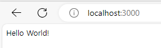
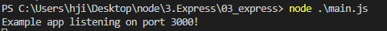
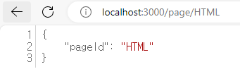
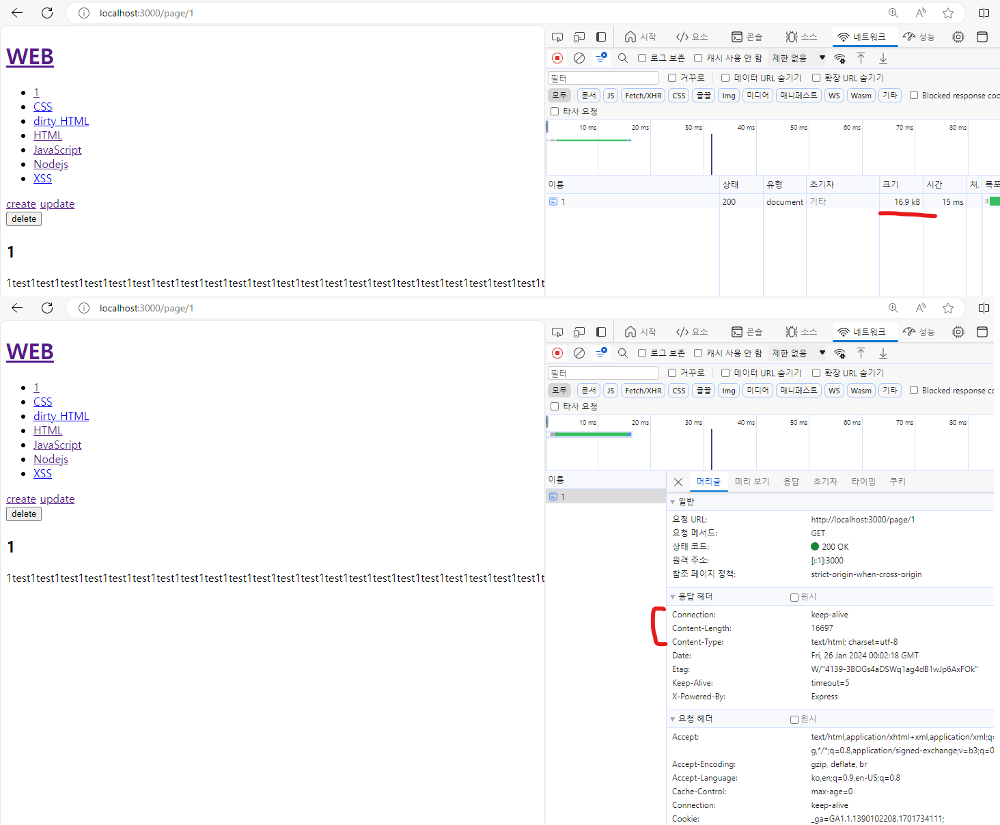
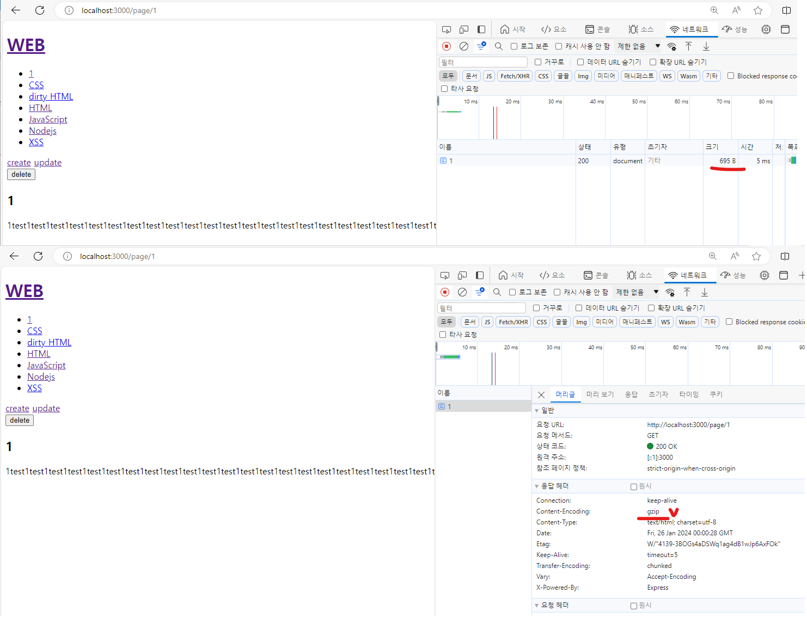
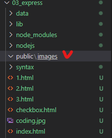
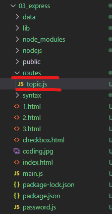

# Express
* Express : Node.js 위에서 동작하는 웹 프레임워크
> 프레임워크 : 반복적으로 어디서나 등장하는 기능을 처리할 때, 더 적은 코드와 지식으로도 더 많은 일을 더 안전하게 처리할 수 있게 도와주는 도구. 
> => 즉, 공통적인 기능은 프레임워크에 미리 구현된 기능을 사용하고, 웹 개발자는 해당 웹 사이트의 개성에 집중할 수 있게 하려는 목적으로 만들어진 일종의 반제품
* 설치 : <code>$ npm install express --save</code> https://expressjs.com/
* 기본 설정 : 
    ```
    mkdir express-dir
    cd express-dir

    npm init

    =====================================

    const express = require('express');
    const app = express();
    const port = 3000;

    app.get('/', (req, res) => res.send('Hello World!'))
    app.listen(port, () => console.log('Example app listening on port ${port}!'))
    ```
    
    
<br><br>
---   

### Express
* express 프레임워크의 핵심 골격 : **웹 서버실행 + API 라우팅**
* **웹 서버 실행** : <code>app.listen(port, callback)</code>
    * listen이라는 메서드가 실행될 때 비로소 웹 서버가 실행되며, 해당 포트로 사용자의 요청을 받을 수 있게 된다.
    * ex ) <code>app.listen(port, () => console.log('Example app listening on port ${port}!'))</code>

* **Express 프레임워크의 API 라우팅** 레퍼런스
    * GET 메서드 : <code>app.get(path, callback [, callback])</code><br/>
            => <code>app.get(경로, 사용자가 해당 경로에 접속했을 때 호출할 함수 [, callback])</code>
        * ex) <code>app.get('/', (req, res) => res.send('Hello World!'))</code>
    * POST 메서드 : <code>app.post(path, callback)</code><br/>
        * ex)
            ```javascript
            app.post('/create_process', function(request, response){
                var body = '';
                request.on('data', function(data) {
                    body = body + data;
                });
                request.on('end', function() {
                    var post = qs.parse(body);
                    var title = post.title;
                    var description = post.description;
                    fs.writeFile(`data/${title}`, description, 'utf8', function(err) {
                        response.writeHead(302, {Location: `/page/${title}`});
                        response.end();
                    });
                });
            })

            app.post('/delete_process', function(request, response){
                var body = '';
                request.on('data', function(data) {
                    body = body + data;
                });
                request.on('end', function() {
                    var post = qs.parse(body);
                    var id = post.id;
                    var filteredId = path.parse(id).base;
                    fs.unlink(`data/${filteredId}`, function(error) {
                        response.redirect('/'); // express의 redirect 처리 방법
                    });
                });
            })
            ```
> 라우팅 : 사용자들이 여러 경로로 들어올 때 경로마다 응답해주는 기능

<br><br>
---   

### Express를 이용한 CRUD
* 상세 페이지 구현 시 쿼리 스트링 전달이 아닌 시맨틱 URL 방식을 사용한다.
* 시맨틱 URL(semantic URL) : 질의어 없이 경로만 가진 간단한 구조의 URL로, 사용하기 쉽고 검색엔진에 친화적이다.
    * ex ) <code>?id=HTML -> page/HTML</code>
    ```javascript
    app.get('/page/:pageId', (req, res) =>{ // 사용자가 page 다음에 입력한 경올가 pageID로 들어오게 된다.
        res.send(req.params); // 키:값 형태로 가져올 수 있다.
    })
    ```
    
    <br><br>
* CRUD 예제 코드
    ```javascript
    const express = require('express'); // const : 상수(바뀌지 않는 값), require를 사용 : express도 결국 모듈이다.
    const app = express(); // express()의 return 값 : express 프레임워크에서 제공하는 Application 객체
    const fs = require('fs');

    app.get('/', (request, response) => {
    fs.readdir('./data', function (error, filelist) {
        var title = 'Welcome';
        var description = 'Hello, Node.js';
        var list = template.list(filelist);
        var html = template.HTML(title, list,
            `<h2>${title}</h2><p>${description}</p>`,
            `<a href="/create">create</a>`
        );
        response.send(html);
    });

    app.get('/page/:pageId', (req, res) => { // 사용자가 page 다음에 입력한 경올가 pageID로 들어오게 된다.
        // res.send(req.params); // 키:값 형태로 가져올 수 있다.
        fs.readdir('./data', function (error, filelist) {
            var filteredId = path.parse(req.params.pageId).base; // 매개변수 이용
            fs.readFile(`data/${filteredId}`, 'utf8', function (err, description) {
                var title = req.params.pageId;
                var sanitizedTitle = sanitizeHtml(title);
                var sanitizedDescription = sanitizeHtml(description, {
                    allowedTags: ['h1']
                });
                var list = template.list(filelist);
                var html = template.HTML(sanitizedTitle, list,
                    `<h2>${sanitizedTitle}</h2><p>${sanitizedDescription}</p>`,
                    `<a href="/create">create</a>
                            <a href="/update/${sanitizedTitle}">update</a>
                            <form action="/delete_process" method="post">
                                <input type="hidden" name="id" value="${sanitizedTitle}">
                                <input type="submit" value="delete">
                            </form>`
                );
                res.send(html);
            });
        });
    })

    app.post('/delete_process', function(request, response){
        var body = '';
        request.on('data', function(data) {
            body = body + data;
        });
        request.on('end', function() {
            var post = qs.parse(body);
            var id = post.id;
            var filteredId = path.parse(id).base;
            fs.unlink(`data/${filteredId}`, function(error) {
                response.redirect('/'); // express의 redirect 처리 방법
            });
        });
    })

    app.listen(3000, () => console.log('Example app listening on port 3000!'))
    ```
<br><br>
---   

### Express 미들웨어
* express의 핵심 기능 : 라우트 + 미들웨어
* 미들웨어 : 여러 사람이 개발한 소프트웨어를 이용해 생산성을 높이려고 할 때 사용하는 기능
> 서드파티 미들웨어 : **'남들이 만든'** -> 즉, express가 기보능로 제공하는 기능이 아닌 다른 사람이 만든 소프트웨어 

* 사용하기 괜찮은 미들웨어
    * body-parser : post 방식의 데이터는 크기가 클 수 있다. 이 때, body-parser라는 미들웨어를 사용하면 좀 더 간결하면서 우아하고 안정적인 코드를 작성할 수 있다. => body : 웹 브라우저에서 요청한 정보의 본문, 즉, body-parser는 **요청 정보의 본문을 해석해서 우리에게 필요한 형태로 가공해주는 프로그램**
        * 적용 : <code>npm install body-parser --save</code>
            ```javascript
            
            const bodyParser = require('body-parser');

            app.use(bodyParser.urlencoded({extended: false})); //익스프레스의 use메서드에 body-parser라는 미들웨어 전달 : 해당 미들웨어가 실행되고 그 결과를 전달받는다. => 즉, main.js가 실행될 떄마다(사용자의 요청이 있을 때마다) 미들웨어가 실행된다.

            app.post('/create_process', function (request, response) {
                var post = request.body;
                var title = post.title;
                var description = post.description;
                fs.writeFile(`data/${title}`, description, 'utf8', function (err) {
                    response.writeHead(302, {
                        Location: `/page/${title}`
                    });
                    response.end();
                });
            })

            ```
    * compression : **압축**으로, 내가 개발한 웹 사이트에 수많은 사용자가 접속하고 큰 데이터들을 내려받는다면 비용도 시간도 많이 들어서 부담이 된다. 즉, 웹서버가 웹 브라우저에 응답할 때 해당 데이터를 압축해서 보낼 수 있다.
        * 데이터를 압축하면 데이터를 전송할 때 압축된 데이터가 전송되기 때문에 데이터의 양이 획기적으로 줄어들 수 있다. 물론 데이터를 압축하고 해제하는 과정에서 시간 비용이 소요되지만, 일반적으로 큰 데이터를 전송하면서 발생하는 네트워크 비용보다는 적다. => 따라서 크기가 큰 데이터를 전송할 때는 압축방식을 많이 사용한다.
        * 적용 : <code>npm install compression --save</code>
        ```javascript
        const compression = require('compression'); //1. 모듈 부르기

        app.use(compression()); // 2. 모듈을 사용하겠다고 선언하기
        ```
        <table>
        <tr>
        <td>적용 전 (16.9KB)</td>
        <td>적용 후 (695B)</td>
        <tr>
        <td></td>
        <td></td>
        <tr>
        </table>
<br/>

#### 미들웨어 직접 만들어 보기
* Express 공식 페이지에서 제공하는 미들웨어 생성 가이드
```javascript
const express = require('express')
const app = express()

const myLogger = function (req, res, next) {
  console.log('LOGGED')
  next()
}

app.use(myLogger)

app.get('/', (req, res) => {
  res.send('Hello World!')
})

app.listen(3000)
```

* main.js에서 직접 미들웨어 만들어서 적용해보기
    ```javascript
    // 적용 전
    app.get('/', (request, response) => {
        fs.readdir('./data', function (error, filelist) {
            var title = 'Welcome';
            var description = 'Hello, Node.js';
            var list = template.list(filelist);
            var html = template.HTML(title, list,
                `<h2>${title}</h2><p>${description}</p>`,
                `<a href="/create">create</a>`
            );
            response.send(html);
        });
    })

    ==================================================================
    // 적용 후
    app.use(function(request, response, next){
        fs.readdir('./data', function(error, filelist){
            request.list = filelist;
            next();
        })
    });

    app.get('/', (request, response) => {
        // fs.readdir('./data', function (error, filelist) {
            var title = 'Welcome';
            var description = 'Hello, Node.js';
            var list = template.list(request.list);
            var html = template.HTML(title, list,
                `<h2>${title}</h2><p>${description}</p>`,
                `<a href="/create">create</a>`
            );
            response.send(html);
        // });
    })
    ```
    * 이처럼 미들웨어를 사용함으로써 코드가 단순해졌고 양도 줄었다. 하지만 해당 미들웨어를 사용하지 않아도 되는 곳에서까지 모든 요청이 있을 때마다 미들웨어 실행되는 것은 비효율적이다. <br>
    *  이 문제는 미들웨어를 정의한 부분에서 use 메서드 대신 get 메서드를 사용해 해결 할 수 있다. : **get으로 정의**해 get방식일 때만 부르도록 한다.
        ```javascript
        app.get('*', function(request, response, next){
            fs.readdir('./data', function(error, filelist){
                request.list = filelist;
                next();
            })
        });
        ```
<br/>

#### 미들웨어의 실행 순서
* 미들웨어의 타입
    * 애플리케이션 레벨 미들웨어
        * ex) use, get, post
    * 라우터 레벨 미들웨어
    * 에러 핸들링 미들웨어
    * 내장 미들웨어
    * 서드파티 미들웨어
        * ex) compression, body-parser
* 애플리케이션 레벨 미들웨어
    * 미들웨어의 핵심 : 콜백함수의 매개변수인 요청(req)과 응답(res) 객체를 받아서 활용할 수 있음. 또한 next 함수를 이용해 그 다음 미들웨어의 실행 여부를 이전 미들웨어에서 호출(next())여부로 결정할 수 있다.
    ```javascript
    var app = express()

    app.use((req,res, next) =>{
        console.log('Time: ', Date.now())
        next()
    })
    
    app.use('/user/:id', (req,res, next) =>{ // 특정 경로에서만 동작하게 할 수 있다.
        console.log('Time: ', Date.now())
        next()
    })

    
    app.get('/user/:id', (req,res, next) =>{ // get이나 post 등 전송방식에 따라 미들웨어가 동작하게 할 수도 있다.
        console.log('Time: ', Date.now())
        next()
    })

    // use 메서드에 콜백함수 2개를 연속으로 정의한 예시로, 여러 미들웨어를 이어서 정의할 수도 있다. => 첫번째 콜백 함수에 있는 next()는 두번째 콜백 함수를 호출하는 것과 같다.
    app.use('/user/:id', (req,res, next) =>{ 
        console.log('Time 1: ', Date.now())
        next()
    }, function(req,res,next){
        console.log('Time 2: ', Date.now())
        next()
    })

    // 실행 순서 : 1 -> 2 -> 3
    app.get('/user/:id', (req,res, next) =>{ // 1번 
        console.log('Time 1: ', Date.now())
        next()
    }, function(req,res,next){ // 2번
        console.log('Time 2: ', Date.now())
    })

    app.get('/user/:id', (req,res, next) =>{ // 3번
        console.log('Time: ', Date.now())
    })

    // 실행 순서 : 0일때 - 1-> 3, 0이 아닐 때 - 1 -> 2
    app.get('/user/:id', (req,res, next) =>{ // 1번 
        if(req.params.id === '0') next('route)
        else next()
    }, function(req,res,next){ // 2번
        console.log('Time 2: ', Date.now())
    })

    app.get('/user/:id', (req,res, next) =>{ // 3번
        console.log('Time: ', Date.now())
    })

    ```
    => 이처럼 미들웨어를 잘 설계하면 애플리케이션이 실행되는 순서를 제어할 수 있다.
<br><br>
---   

### 정적인 파일의 서비스
* 정적인 파일 : 웹 브라우저로 내려받는 이미지, JS, CSS 같은 파일
    * 폴더 구조 시 : /public/images 위치에 넣기<Br>
    <Br>
    ```javascript
    app.use(express.static('public')); // public 폴더에서 파일을 찾겠다는 의미

    app.get('/', (request, response) => {
        var title = 'Welcome';
        var description = 'Hello, Node.js';
        var list = template.list(request.list);
         var html = template.HTML(title, list,
            `<h2>${title}</h2><p>${description}</p>
            
            `,
            `<a href="/create">create</a>`
        );
        response.send(html);
    })
    ```
<br><br>
---   

### 에러 처리
* 404 처리
    ```javascript
    app.use(function(req,res, next){
        res.status(404).send('Sorry cant find that!');
    })

    ```
* 상세 페이지에서 해당 페이지가 없을 때 처리 + 500에러 처리
    ```javascript
    app.get('/page/:pageId', (req, res, next) => { // 사용자가 page 다음에 입력한 경올가 pageID로 들어오게 된다.
    // res.send(req.params); // 키:값 형태로 가져올 수 있다.
    // fs.readdir('./data', function (error, filelist) {
        var filteredId = path.parse(req.params.pageId).base; // 매개변수 이용
        fs.readFile(`data/${filteredId}`, 'utf8', function (err, description) {
            if(err){
                next(err); // next() : 정상, next('route') : 정상, next(err) : next함수에 'route'이외의 인자 전달 시 에러가 발생한 것으로 간주함.
            }
            else{
                var title = req.params.pageId;
                var sanitizedTitle = sanitizeHtml(title);
                var sanitizedDescription = sanitizeHtml(description, {
                    allowedTags: ['h1']
                });
                var list = template.list(req.list);
                var html = template.HTML(sanitizedTitle, list,
                    `<h2>${sanitizedTitle}</h2><p>${sanitizedDescription}</p>`,
                    `<a href="/create">create</a>
                            <a href="/update/${sanitizedTitle}">update</a>
                            <form action="/delete_process" method="post">
                                <input type="hidden" name="id" value="${sanitizedTitle}">
                                <input type="submit" value="delete">
                            </form>`
                );
                res.send(html);
            }
        });
    // });
    })


    app.use(function(err, req, res, next){ // 에러 핸들러를 위한 미들웨어는 다른 미들웨어와 다른게 매개변수가 4개이다. => 이처럼 매개변수가 4개면 익스프레스 프레임워크는 에러 핸들러로 인식한다. => 따라서 next 함수로 미들웨어를 호출할 때 인자를 전달하면 첫번 째 매개변수 인 err에 전달된다.
        console.error(err.stack)
        res.status(500).send('Something broke!')
    })

    ```
<br><br>
---   

### 라우터
* 주소 체계 변경
    * if) 상세보기 페이지 : /topic/:id 일 때, 생성 페이지 : /topic/create 라면<br>
    <code>/topic/create</code>로 접속 시 상세보기 페이지로 이동할 수 있다.<br>
    => 이 때, 생성 페이지로 이동하고 싶은 거라면 app.use('/topic/create')부분을 상세보기 페이지 보다 상단으로 올려주면 된다.
* 파일로 분리 : 익스프레스 라우터 기능 사용
    * 폴더 구조 : <Br>
    * <code>var router = express.Router();</code> : Express 모듈의 Router 메서드를 호출에 router 객체를 얻는다. 이 메서드의 return 값은 router 객체이다.<br>
    => main.js에서는 express()라는 자체 모듈을 호출했고(return : 애플리케이션 객체), topic.js에서는 express가 가지고 있는 Router() 메서드를 호출한다.(return : router 객체) <br>
    => express.Router() 메서드는 애플리케이션 객체가 아닌 라우터 객체를 반환하므로 app.get()이 아닌 router.get()을 호출해야 한다.
    * 적용
        ```javascript
        // main.js
        const topicRouter = require('./routes/topic');

        app.use('/topic', topicRouter); // topic으로 시작하는 주소에 topicRouter라는 이름의 미들웨어를 적용하겠다는 의미

        // ==========================================================
        // topic.js

        // 전제 조건 : 이 파일에 있는 url이 모두 /topic으로 시작한다고 했을 때 

        var express = require('express');
        var router = express.Router(); // 라우터 객체를 반환하므로, app.get()이 아닌 router.get()을 호출해야한다.
        const fs = require('fs');
        const template = require('../lib/template.js');
        const path = require('path');
        const sanitizeHtml = require('sanitize-html');

        router.get('/create', function (request, response) {
                var title = 'WEB - create';
                var list = template.list(request.list);
                var html = template.HTML(title, list, `
                    <form action="/create_process" method="post">
                        <p><input type="text" name="title" placeholder="title"></p>
                        <p>
                            <textarea name="description" placeholder="description"></textarea>
                        </p>
                        <p>
                            <input type="submit">
                        </p>
                    </form>
                `, '');
                response.send(html);
            // });
        })

        ...

        module.exports = router;
        ```
    * 적용 - index
        ```javascript
        // main.js
        const indexRouter = require('./routes/index');

        app.use('/', indexRouter);

        // ==========================================================
        // index.js

        // 전제 조건 : 이 파일에 있는 url이 모두 /으로 시작한다고 했을 때 

        var express = require('express');
        var router = express.Router(); // 라우터 객체를 반환하므로, app.get()이 아닌 router.get()을 호출해야한다.
        const template = require('../lib/template.js');

        router.get('/', function (request, response) {
            ....
        })

        ...

        module.exports = router;
        ```
<br><br>
---   

### 보안
* 익스프레임 프레임워크 사용 시 보완과 관련된 지침
    1. 익스프레스 버전을 최신으로 유지
    2. TLS 사용
        * 보안이 강화된 HTTPS사용 : 웹 서버와 웹 브라우저가 통신 할 때, 서로 암호화해서 사용하기 때문에 중간에 누군가가 데이터를 가로채더라도 데이터의 실제 내용을 알 수 없게 만듬. 또한 피싱(웹 사이트의 도메인 등을 변조)을 하더라도 인증서를 통해 이를 알아차릴 수 있게 경고 메시지를 띄울 수 있음.<br>
        => TLS(=SSL) : HTTPS
    3. Helmet 모듈 사용
        * 자주 발생하는 보안과 관련된 이슈를 자동으로 해결하는 모듈
        * 설치 : <code>npm install --save helmet</code>
        * 적용 : <code>var helmet = require('helmet'); app.use(helmet());</code> => Helmet 모듈이 가진 보안 기능이 자동으로 설정됨.
    4. 쿠키를 안전하게 사용
        * 쿠키 : 웹 사이트를 사용자가 방문 할 때, 누가 방문했는지 방문자 한 명 한 명을 식별하는 확인 방법
    5. 종속 모듈이 안전한지 확인
        * 웹 어플리케이션이 사용하는 여러 모듈에 취약점이 있는지 확인하고 제거하라는 의미
        * nsp : 취약점 검사 모듈
            * 설치 : <code>npm i nsp -g</code> - i : install, -g : 이 컴퓨터 전체에서 사용
            * 실행 : <code>nsp check</code> - 이렇게 하면  nsp가 우리 애플리케이션의 package.json 파일에서 dependencies 항목에 나열된 모듈을 검사해서 취약점이 있는지 확인한다.
<br><br>
---   

### 익스프레스 제너레이터
1. 제너레이터 설치
    * <code>npm install express-generator -g</code>
    * 제너레이터 사용 예시 : <code>express -h</code>
2. 제너레이터를 이용해 프로젝트 시작
    * <code>express "폴더 이름"</code>
    * <code>cd "폴더 이름"</code>
    * <code>npm install</code>
    * <code>npm start</code> : 이 명령은 package.json 파일에 정의된 대로 bin 디렉터리의 www 파일을 실행한다.
        ```
        "script" : {
            "start" : "node ./bin/www"
        }
        ```
    * 3000번 포트로 접속 시 routes/index.js을 가르킨다.
* 템플릿 엔진 기능 설정
    * 설정 :
        ```javascript
        app.set('views', path.join(__dirname, 'views'));
        app.set('views engin', 'jade');
        ```
        <br>
        => views 디렉터리 아래에 있는 jade라는 확장자를 가진 파일들을 가리키는데, jade는 HTML코드를 좀 더 적은 코드로 생성해주는 문법이다.
    * 퍼그(pug) : 템플릿 엔진 중 하나로, 간단히 html 코드로 변환해주는 엔진
        ```html
        <!-- 이렇게 작성했을 때 -->
        a(href='google.com') Google
        |
        |
        a(class='button' href='google.com') Google
        |
        |
        a(class='button' href='google.com') Google

        input(
            type='checkbox'
            name='agreement'
            checked
        )

        - for (var x = 0; x < 3; x++)
            li item
        <!-- 이렇게 변환해 준다. -->
        <a href="google.com">Google</a>
        <a class="button" href="google.com">Google</a>
        <a class="button" href="google.com">Google</a>

        <input type="checkbox" name="agreement" checked="checked" />
        
        <li>item</li>
        <li>item</li>
        <li>item</li>
        ```
        이 밖에도 조건문이나 include를 이용해 퍼그로 만든 다른 코드를 읽어올 수도 있고, 상속(Inheritance)이라고 하는 세련되고 생산성을 높여주는 프로그래밍 기법도 지원된다. 