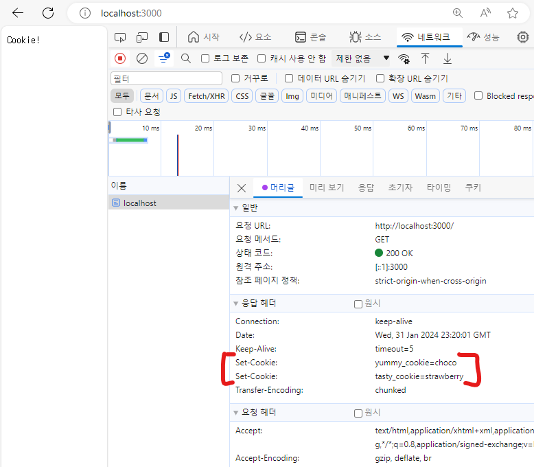

# 쿠키
* 개인화 : 사람마다 선택과 취향에 맞는 웹 페이지를 보여주는 것
* 쿠키 : 쿠키가 도입되면서 웹 브라우저는 이전에 접속했던 사용자의 정보를 웹 서버로 전송할 수 있게 됐고, 웹 서버는 이 정보를 바탕으로 현재 접속한 사용자가 누구인지도 알 수 있다.
<br><br>
---   

### 쿠키
* 쿠키 : 웹 브라우저와 웹 서버가 주고받는 정보, HTTP 프로토콜에 속한 기술
    * 용도
        1. 세션 관리(인증) : 서버에 저장해야 할 정보를 관리
        2. 개인화 : 사용자 선호, 테마 등의 설정
        3. 트래킹 : 사용자 행동을 기록하고 분석하는 용도
#### 쿠키의 생성
* 기본 : <code>Set-Cookie : "cookie-이름"="cookie-값"</code>
    ```yml
    HTTP/1.0 200 OK <!-- HTTP의 응답 메시지 -->
    Content-type: text/html
    Set-Cookie: yummy_cookie=choco <!-- 쿠키 생성 -->
    Set-Cookie: tasty_cookie=strawberry <!-- 쿠키 생성 -->

    [page content]
    ```
* Node.js를 이용한 쿠키 생성
    ```javascript
    var http = require('http');

    http.createServer(function(request, response){
        response.writeHead(200, {
            'set-cookie':['yummy_cookie=choco', 'tasty_cookie=strawberry']
        })
        response.end('Cookie!');
    }).listen(3000);
    ```
    

#### 쿠키 읽기
* 생성한 쿠키를 웹 브라우저가 다시 웹 서버 쪽으로 전송(요청)했을 때 이것을 웹 애플리케이션에서 어떻게 알아낼 수 있는지
* 쿠키 모듈 설치 : <code>npm install -s cookie</code>
* 적용
    ```javascript
    var http = require('http');
    var cookie = require('cookie');

    http.createServer(function(request, response){
        console.log(request.headers.cookie); // return : yummy_cookie=choco; tasty_cookie=strawberry
        var cookies = {};
        if(request.headers.cookie !== undefined){ // cookie가 없을 때 에러나지 않게 하기 위해 설정
            cookies = cookie.parse(request.headers.cookie); // 쿠키값이 객체화 되어 다루기 쉬워진다. => return : { yummy_cookie:'choco', tasty_cookie: 'strawberry'}
        }
        
        console.log(cookies.yummy_cookie); // 부르는 방법 => return : choco

        response.writeHead(200, {
            'set-cookie':['yummy_cookie=choco', 'tasty_cookie=strawberry']
        })
        response.end('Cookie!');
    }).listen(3000);
    ```

#### 쿠키 활용 예시
* 언어 설정 : 웹 사이트에 마지막으로 접속한 언어를 기억하고, 그 다음부터는 나에게 맞는 개인화된 (마지막으로 선택한 언어로) 페이지를 보여줄 수 있다.
    * cookie값을 보면 LANG이라는 쿠키값을 KO 또는 EN으로 바꾸고 이에 맞는 언어로 표시된다.

<br><br>
---   

### 세션(Session)과 영구 쿠키(Permanent 쿠키)
**쿠키가 언제까지 살아있게 할 것인가?**
* 쿠키의 종류
    1. 세션 쿠키(session cookie) : **웹 브라우저가 켜져 있는 동안에만 유효한 쿠키**로서, 브라우저를 종료했다가 다시 실행하면 사라져 있다.
        * 옵션을 설정하지 않을 때, 생성 된다.
        ```javascript
        response.writeHead(200, {
            'set-cookie':[
                'yummy_cookie=choco',
                'tasty_cookie=strawberry',
            ]
        })
        ```
    2. 영구 쿠키(permanent cookie) : **영속적인 쿠키**로서, 웹 브라우저를 종효했다가 다시 실행해도 쿠키가 살아 있다.
        * Max-Age나 Expires같은 옵션을 설정하면 생성된다.
            * Max-Age : 쿠키가 현재부터 얼마 동안 유효한지 지정(상대적, 초 단위로 지정(60 x 60 x 24 : 1일), 역따옴표 사용(<code>``</code>)) 
            * Expires : 쿠키를 언제 해지할 지 지정(절대적)
        ```javascript
        response.writeHead(200, {
            'set-cookie':[
                'yummy_cookie=choco',
                'tasty_cookie=strawberry',
                `Permanent=cookies; Max-Age=${60*60*24*30}`
            ]
        })
        ```
<br><br>
---   

### 쿠키 옵션
#### 보안 관련 옵션 (Secure, HttpOnly)
* Secure : 웹 브라우저와 웹 서버가 HTTPS 프로토콜로 통신하는 경우에만 쿠키를 전송하는 옵션
    * HTTPS를 사용할 때만 웹 브라우저가 웹 서버에 쿠키를 전송할 수 있게 하는 이유 : 쿠키값을 가로채면 악의적으로 사용할 수 있는데, HTTP를 통해 통신하면 쿠키값을 너무 쉽게 가져갈 수 있기 때문이다. 이를 방지하기 위해 <code>Secure</code>를 이용해 HTTPS 통신을 할 떄만 쿠키를 전송할 수 있게 하면 쿠키값을 가로채는 것을 방지 할 수 있다. 
    ```javascript
    response.writeHead(200, {
        'set-cookie':[
            'Secure_Cookie=Secure_value; Secure' // 세미콜론 뒤에 Secure 옵션 지정 : HTTPS 프로토콜로 콩신하는 경우에만 쿠키가 생성되게 함.
        ]
    })
    ```
* HttpOnly : HTTP 프로토콜로 통신하는 경우에도 쿠키를 전송하지만 자바스크립트로는 쿠키값을 가져올 수 없게 하는 옵션
    ```javascript
    response.writeHead(200, {
        // 'set-cookie':['yummy_cookie=choco', 'tasty_cookie=strawberry']
        'set-cookie':[
            'HttpOnly_Cookie=HttpOnly_value; HttpOnly' // 세미콜론 뒤에 HttpOnly 옵션 지정 : HTTP에서도 쿠키값을 가져올 수 있지만, 자바스크립트 코드로는 그 값을 가져올 수 없게 한다. 
        ]
    })

    // js 콘솔 창에 cookie 검색 시 return
    // >> "Permanent=cookies; yummy_cookie=choco; tasty_cookie=strawberry"
    // ==> HttpOnly_Cookie=HttpOnly_value는 뜨지 않는다.
    ```
<br>

#### 쿠키를 제어하는 방법과 관련된 옵션 (Path, Domain)
* Path : 특정 디렉터리(경로)와 해당 디레터리의 하위 디렉터리에서만 쿠키가 활성화되게 하는 것
    * 해당 경로(+ 하위주소)로 접속 시에만 쿠키가 보임
    ```javascript
    response.writeHead(200, {
        'set-cookie':[
            'Path_Cookie=Path_value; Path=/cookie' // 세미콜론 뒤에 Path 옵션 지정 : 특정 디렉터리(경로)에서만 쿠키가 활성화되게 하는 것
        ]
    })
    ```
* Domain : 어떤 서브도메인에서도 생성되는 쿠키를 만들 수 있는 옵션
    ```javascript
    response.writeHead(200, {
        'set-cookie':[
            'Domain_Cookie=Domain_value; Domain=o2.org' // 세미콜론 뒤에 Domain 옵션 지정 : 특정 도메인에서만 쿠키가 활성화되게 하는 것
        ]
    })
    ```
* 즉, path : 어느 path에서 동작하게 할 것인지 제한, Domain : 어느 도메인에서 동작하게 할 것인지 제한
<br><br>
---   

### 쿠키를 이용한 인증 기능
* 로그인(쿠키 생성) 
    ```javascript
    if(pathname === '/login'){
        fs.readdir('./data', function(error, filelist) {
            var title = 'Login';
            var list = template.list(filelist);
            var html = template.HTML(title, list,
                `<form action="login_process" method="post">
                    <p><input type="text" name="email" placeholder="email"></p>
                    <p><input type="password" name="password" placeholder="password"></p>
                    <p><input type="submit"></p>
                </form>`,
                `<a href="/create">create</a>`
            );
            response.writeHead(200);
            response.end(html);
        })
    } else if(pathname === '/login_process') {
        var body = '';
        request.on('data', function(data) {
            body = body + data;
        });
        request.on('end', function() {
            var post = qs.parse(body);
            if(post.email === 'a@n.c' && post.password==="11"){
                response.write(302, {
                    'set-cookie': [
                        `email=${post.email}`,
                        `password=${post.password}`,
                        `nickname=a`,
                    ],
                    Location: `/`
                })
                response.end();
            } else {
                response.end('who?');
            }
        });
    } 
    ```
* 접근제어(ACL : Access Control List) : 로그인/로그아웃 기능의 진짜 목표, 특정 페이지에 대한 접근을 허용하거나 금지하는 것
    * 로그인 중인지 확인
    ```javascript
    var cookie = require('cookie');

    function authIsOwner(request, response){
        var isOwner = false; //소유자임을 확인하는 변수 : cookie에 값이 제대로 들어오면 true로 변환
        var cookies = {};
        if(request.headers.cookie){ // cookie가 없을 때 에러나지 않게 하기 위해
            cookies = cookie.parse(request.headers.cookie); // 쿠키값이 객체화 되어 다루기 쉬워진다. => return : { yummy_cookie:'choco', tasty_cookie: 'strawberry'}
        }
        console.log(cookies);
        if(cookies.email === 'a@n.c' && cookies.password==="11"){ // cookie에 값이 제대로 들어오면 true로 변환
            isOwner = true;
        }
        return isOwner;
    }

    var app = http.createServer(function(request, response) {

        var isOwner = authIsOwner(request, response);
        console.log(isOwner);
    });
    app.listen(3000);
    ```
    * 로그인 중일 때, 로그아웃 화면 나오도록 하기
        ```javascript
        function authStatusUI(request, response) {
            var authStatusUI = '<a href="/login">login</a>';
            if(authIsOwner(request, response)){
                authIsOwner = '<a href="/logout_process">logout</a>'
            }
            return authStatusUI;
        }
        ```
    * 로그인 중일 때만, 글 생성/수정/삭제 가능
        ```javascript
        else if (pathname === '/create_process') {
            if(authIsOwner(request, response) === false){
                response.end('로그인 필요!');
                return false;
            }

            var body = '';
            request.on('data', function (data) {
                body = body + data;
            });
            request.on('end', function () {
                var post = qs.parse(body);
                var title = post.title;
                var description = post.description;
                fs.writeFile(`data/${title}`, description, 'utf8', function (err) {
                    response.writeHead(302, {
                        Location: `/?id=${title}`
                    });
                    response.end();
                });
            });
        }
        ```
* 로그아웃(쿠키 삭제)
    ```javascript
    else if (pathname === '/logout_process') {
        var body = '';
        request.on('data', function (data) {
            body = body + data;
        });
        request.on('end', function () {
            var post = qs.parse(body);
            response.write(302, {
                'set-cookie': [
                    `email=; Max-Age=0`,
                    `password=; Max-Age=0`,
                    `nickname=; Max-Age=0`,
                ],
                Location: `/`
            })
            response.end();
        });
    } 
    ```
> * 과거에는 쿠키가 브라우저에 정보를 저장하는 유일한 방법이였지만, 오늘날에는 다양한 방법이 생겨나고 있다. 
>   * ex ) localStorage, Indexed DB
> * 이러한 새로운 대안은 더 많은 기능을 더 편리하게 사용할 수 있거나, 더 많은 데이터를 저장할 수 있다.
>   * ex ) 쿠키는 4KB이상 저장할 수 x | localStorage, Indexed DB는 그보다 훨씬 더 많은 정보를 저장할 수 있다.

> * 비밀번호 보호 수단 : 해시(Hash), salt, key stretching 중첩 => PBKDF2, bycrpt 라이브러리