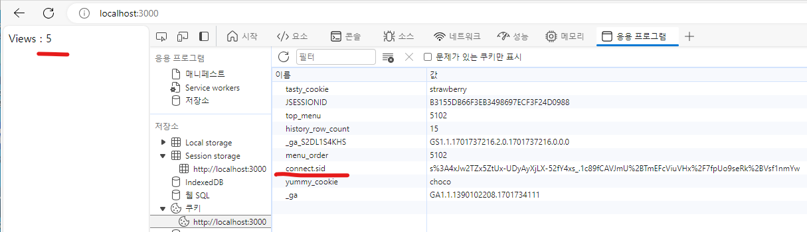

# 세션
* 세션 아이디 자체로 어떤 정보를 알아낼 수 없고, 단지 **사용자를 식별하는 값**으로 기능한다.
* 세션은 사용자의 민감한 정보를 서버쪽에 은밀하게 저장해서 보호하고, 사용자의 웹 브라우저에는 이 정보가 사용자의 것인지 아닌지를 식별하는 데이터만 저장한다.
<br>
=> 따라서 훨씬 더 안전하고 많은 정보를 유지할 수 있다.
* 쿠키는 사용자를 식별하는 데만 사용하고, 실제 데이터는 서버 쪽에 안전하게 파일이나 데이터베이스 형태로 저장한다.(세션)
<br><br>
---   

### express-session 미들웨어
* 설치 : <code>npm install -s express-session</code>
    * -s : 이 프로젝트가 express-session 모듈에 의존하고 있다는 것을 명확하게 하는 역할
    * 적용
        ```javascript
        var session = require('express-session'); // express-session 미들웨어를 모듈로 불러와 session이라는 객체에 저장
        ```
* 옵션
    1. secret (필수 옵션)
        * 다른 사람이 봐서는 안되는 내용이라서 노출하면 안되고 자신만 아는 내용으로 입력한다. 
        * ex ) git 등을 이용해 버전 관리를 한다면 소스 코드에 포함시키면 안되고 별도의 파일에 저장해서 관리해야한다. <Br>실제 서버에 올릴 때는 이 코드를 변수 등으로 처리하는 것이 좋음 
    2. resave : (default false)
        * 데이터를 세션 저장소에 저장할지를 설정한다. 
        * false 시 세션 데이터가 바뀌지 않는 한 세션 저장소에 저장하지 않고, true 시 세션 데이터의 변경 여부와 상관없이 무조건 세션 저장소에 저장한다.
    3. saveUninitialized : (default true)
        * 세션의 구동 여부를 설정한다.
        * true 시 세션이 필요하기 전까지는 세션을 구동하지 않고, false 시 세션의 필요 여부와 상관없이 무조건 세션을 구동한다. <Br>
        => 따라서 false로 설정하면 서버에 부담이 될 수 있다.
    ```javascript
    app.use(session({ // 사용자의 요청이 있을 때마다 app.use 안에 session함수가 호출되어 세션이 시작된다. => 그러면 내부적으로 express-session 미들웨어가 개입해서 애플리케이션이 세션을 사용할 수 있게 처리한다.
        secret: 'keyboard cat', // 옵션 1 : secret : 필수 옵션으로, 다른 사람이 봐서는 안되는 내용이라서 노출하면 안되고 자신만 아는 내용으로 입력한다.
        resave: false, // 옵션 2 : resave : 데이터를 세션 저장소에 저장할지를 설정한다.
        saveUninitialized: true // 옵션 3 :  세션의 구동 여부를 설정한다.
    }));
    ```

* session 객체
    * console.log(req.session); : session 미들웨어는 req 객체의 속성으로 session 객체를 추가한다.
        ```javascript 
        // console 값
        Session {
            cookie: { path: '/', _expires: null, originalMaxAge: null, httpOnly: true },
            views: { '/foo': 1, '/': 1 }
        }
        ```
    ```javascript
    app.get('/', function(req, res, next) {
        console.log(req.session); 
        if(req.session.num === undefined){ // num값이 정의되어있지 않다면 1로 설정
            req.session.num = 1;
        } else { // 정의되어 있다면 기존 값에 1을 더한 다음 req.session.num값을 출력한다.
            req.session.num = req.session.num + 1;
        }
        res.send(`Views : ${req.session.num}`); // 웹 페이지를 새로고침하면 숫자가 1씩 중가한다. => 세션 데이터는 서버의 메모리에 저장되므로 Node.js 서버를 종료하면 세션이 지워진다. 따라서 Node.js 서버를 재구동하면 웹 페이지에 표시되는 숫자는 다시 1부터 시작된다.
    });
    ```
    
    
<br>
* 세션 스토어 (session store)
    * 세션 파일 스토어 적용 시 설치 : <code>npm install session-file-store</code>
    * 적용
        ```javascript
        var FileStore = require('session-file-store')(session); // 세션 파일 스토어를 불러와 미들웨어로 추가함.

        app.use(session({ 
            secret: 'keyboard cat', 
            resave: false,
            saveUninitialized: true, 
            store: new FileStore()
        }));
        ```
        => 적용 후 웹 페이지를 새로 고침하면, sessions 디렉터리에 json 확장자를 가진 세션 파일이 생성된다. 그리고 새로 고침 때마다 해당 파일의 num 카운트가 올라간다.
        <br>
<br>
* 정리
    1. 우리가 사용하는 익스프레스 세션 미들웨어는 사용자가 세션 아이디를 가지고 있는 상태에서 서버로 접속하면 요청 헤더에 쿠키값으로 세션 아이디를 서버에 전달한다.
    2. 서버는 전달받은 세션 아이디에 대응하는 정보를 세션 스토어에서 찾은 다음(ID 값에 대응하는 파일을 읽은 다음), 해당 정보를 객체로 만들어 req 객체의 session 속성에 추가한다. => 세션 파일 스토리지의 경우 num 값이 req.session.num에 들어간다.
    3. 이후에 express-session.js의 조건문을 통해 num 값을 바꾸면 세션 미들웨어가 세션 파일의 num값을 수정하고 요청을 마친다. 그러면 다음 요청 때 해당 세션 파일의 num값을 다시 공급 받게 된다.
    <Br>+) 위 예제로는 이 과정에서 파일 저장소를 사용하였으며, 파일 스토어를 MySQL로 변경 시 MySQL을 세션 스토어로 사용하게 된다.

<br><br>
---   

### 세션 적용
* 로그인
    ```javascript
    router.post('/login_process', function(request, response) {
        console.log(request.list);
        var post = request.body;
        var email = post.email;
        var password = post.pwd;
        if( email === authData.email && password === authData.password){
            // 일반적으로 세션 데이터에는 이메일과 비밀번호와 같은 정보는 저장하지 않고, 사용자가 로그인했는지 알려주는 정보와 닉네임처럼 페이지에 접근할 때마다 필요한 사용자 정보를 저장한다.
            // 이렇게 세션에 사용자의 정보를 담아 두면 데이터베이스나 파일에 다시 접근할 필요가 없어서 효율적이다.
            request.session.is_logined = true;
            request.session.nickname = authData.nickname;
            response.send('Welcome!')
        } else{
            response.send('Who?')
        }
    });
    ```
    
* 로그인 중인지 확인하기
    ```javascript
    module.exports = {
        authIsOwner:function (request, response) {
            if(request.session.is_logined){
                return true;
            } else {
                return false;
            }
        },
        
        authStatusUI:function (request, response) {
            var authStatusUI = '<a href="/auth/login">login</a>'
            if(this.authIsOwner(request, response)){ // 로그인 된 상태라면 로그아웃 링크가 나오도록
                authStatusUI = `${request.session.nickname} | <a href="/auth/logout">logout</a>`
            }
            return authStatusUI;
        }
    }
    ```
* 로그 아웃
    ```javascript
    router.get('/logout', function(request, response) {
        request.session.destroy(function(err){ // 세션을 삭제한 후에 자동으로 호출되는 콜백함수
            response.redirect('/');
        })
    });
    ```
* 접근 제어
    ```javascript
    router.post('/update_process', function(request, response) {
        if(!auth.authIsOwner(request,response)){
            response.redirect('/');
            return false;
        }
        var post = request.body;
        var id = post.id;
        var title = post.title;
        var description = post.description;
        fs.rename(`data/${id}`, `data/${title}`, function(error) {
            fs.writeFile(`data/${title}`, description, 'utf8', function(err) {
                response.redirect(`/topic/${title}`);
                response.end();
            });
        });
    });
    ```
* 세션 저장
    * save()함수를 이용하면 세션 객체에 있는 데이터를 세션 스토어에 즉시 반영한다. 그리고 그 작업이 끝나는대로 콜백함수에서 리다이렉션을 실행함으로써 세션 스토어와의 속도 격차로 인해 발행하는 문제를 막을 수 있다. 
    * save()가 나온 이유
        * 세션 미들웨어는 session 객체를 사용하는 코드를 모두 실행한 후 세션 스토어(세션 저장소)에 기록하는 작업을 한다.<br>
        => 즉, 메모리에 저장된 세션 데이터를 저장소에 반영하는 작업을 함.
        * 그런데 어떤 이유로 저장소가 굉장히 느려졌을 때 세션이 아직 저장되지 않았는데 리다이렉션이 이뤄질 수도 있다.<br>
        => 즉, 인증이 안되는 상황이 발생할 수 있음.
        * 이러한 현상을 막는 방법 중 하나가 session 객체의 save() 함수를 사용하는 것이다.
    * 사용 방법 : <code>request.session.save(function(){...})</code>
    * 적용
        ```javascript
        router.post('/login_process', function(request, response) {
            console.log(request.list);
            var post = request.body;
            var email = post.email;
            var password = post.pwd;
            if( email === authData.email && password === authData.password){
                request.session.is_logined = true;
                request.session.nickname = authData.nickname;
                request.session.save(function(){
                    response.redirect(`/`);
                })
            } else{
                response.send('Who?')
            }
        });
        ```
<br><br>
---

#### session 옵션
* secure : 우리 애플리케이션이 HTTPS 프로토콜에서만 통신하게 강제한다. 
    * 사용 방법 : <code>secure: true</code>
    * 적용
        ```javascript
        app.use(session({
            secure: true,
            ....
        }))
        ```
* HttpOnly : 자바스크립트로 세션 쿠키를 사용할 수 없게 강제하는 것(탈취 방지)
    * 사용 방법 : <code>HttpOnly: true</code>
    * 적용
        ```javascript
        app.use(session({
            HttpOnly: true,
            ....
        }))
        ```

--- 
#### +) 추가 
* 여러 회원이 있을 경우 : 회원 등록, 등록된 회원의 인증, 비밀번호를 잊어버렸을 때의 대안, 로그인 했을 때 해당 회원을 조회하는 등의 기능 구현 필요
* 타사 인증(federation authentication) : 구글, 페이스북, 트위터 같은 회원 정보를 이용해 인증하게 하는 타사의 회원 정보를 이용해 자사의 회원을 식별하는 인증 방법
    * 장점 : 고도의 주의가 요구되는 회원 정보 관리는 타사에 맡기고, 자사는 회원의 식별자만 유지함으로써 보안 사고를 방지할 수 있다. 그리고 회원 가입의 간편함도 제공할 수 있다.
    * OAuth : 타사 인증을 가능하게 해주는 도구로, OAuth 사용 시 타사 인증을 쉽게 구현할 수 있다.
    * Passport.js : Node.js에서 가장 많이 사용되는 인증 라이브러리로 위의 과정을 대신해주는 도구이다.
        * Passport.js를 이용하면 직접 타사 인증을 구현하는 것보다 훨씬 쉽게 타사 인증을 구현할 수 있다. => 인증 구현 시 Passport.js와 같은 라이브러리를 추천!