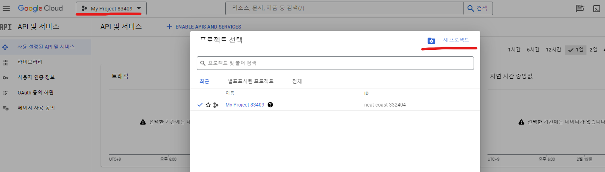
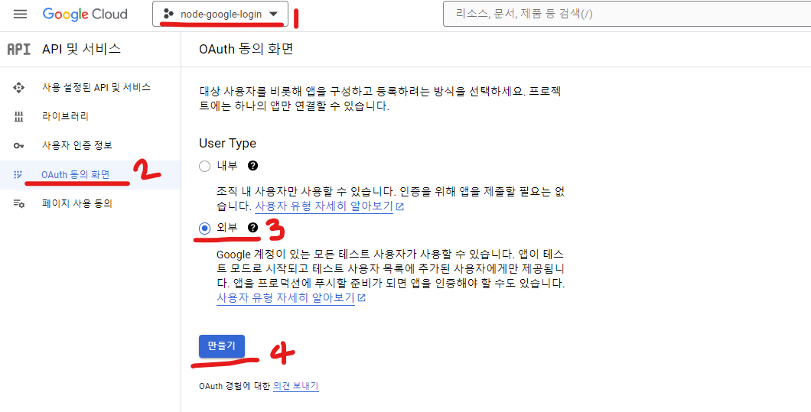
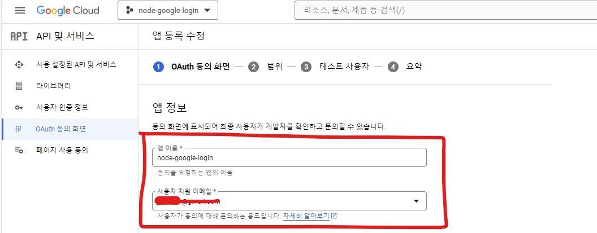
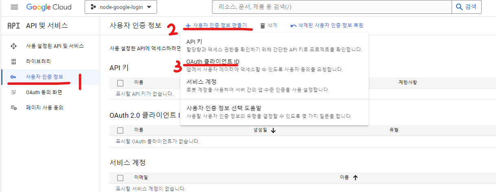
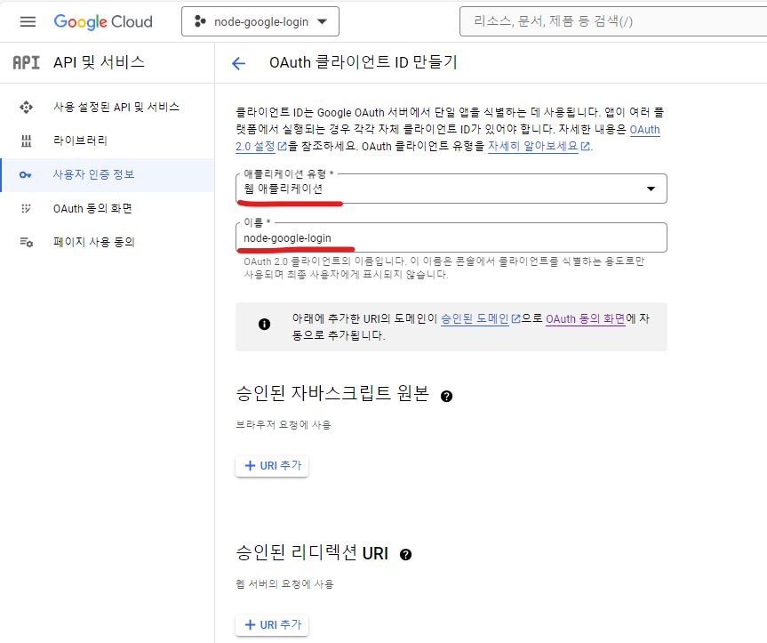
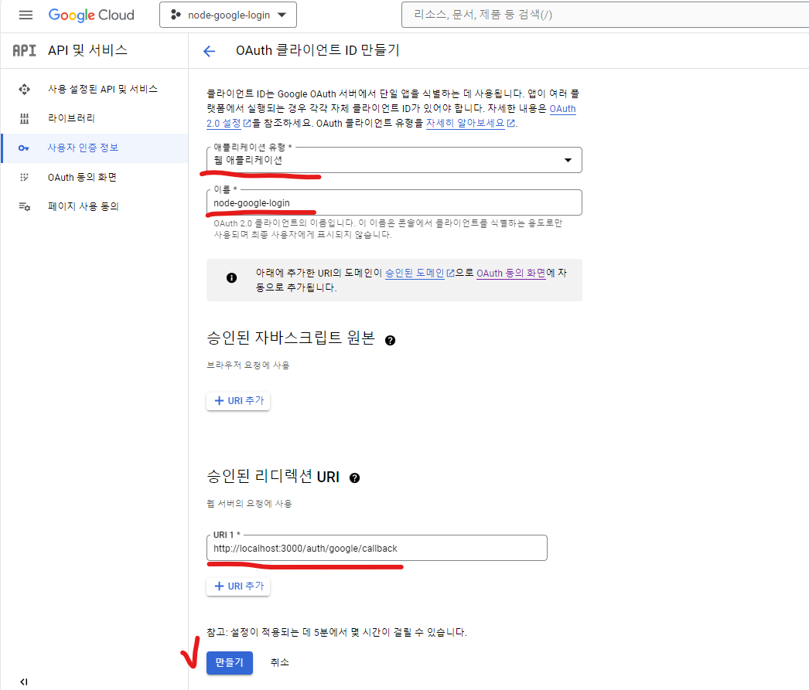
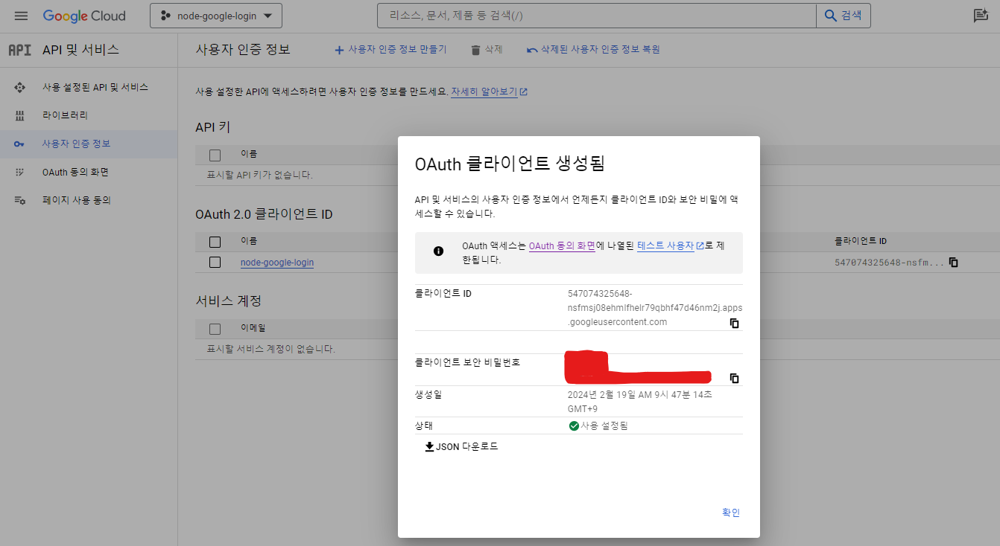

# 구글 로그인
* 타사 인증(Federated Identity) : OAuth 기반
    * 장점
        1. 사용자 : 서비스(우리쪽)에 아이디, 비밀번호를 입력하지 않아도 됨.
        2. 서비스 제공자(우리쪽) : 사용자의 기밀 정보를 보관하지 않아도 됨.
        3. 타사 인증 서비스의 제공자 : 플랫폼에 로크인 하는 효과가 있음.
            > 로크인(lock-in) 효과 : 더 뛰어난 상품이 나와도 소비자가 다른 제품으로 소비를 전환하지 않고 기존 제품이나 서비스에 계속 머무르는 현상  
* OAuth(Open Authorization) : 인터넷 사용자들이 비밀번호를 제공하지 않고 다른 웹 사이트 상의 자신들의 정보에 대해 웹 사이트나 애플리케이션의 접근 권한을 부여할 수 있는 공통적인 수단으로서 사용되는 접근 위임을 위한 개방형 표준
---   

### Passport.js를 이용한 구글 로그인
1. 설치 : <code>npm install -s passport-google-oauth</code>
    * -s : 프로젝트에 의존성을 기록한다
2. 구글 클라우드 플랫폼에서 승인 받기
    * OAuth를 이용하려면 사전에 리소스 서버의 승인을 받고, 리소스 서버로부터 Client Id와 Client Secret이라고 하는 두 개의 값을 받아야 한다.
    * https://console.developers.google.com/
    * **진행 순서**
        1. "프로젝트 선택" 또는 "프로젝트명" 선택 -> "새 프로젝트" 생성 <br>(애플리케이션 1개 = 프로젝트 1개, 프로젝트마다 Client Id와 Client Secret을 발급받아야함.)
            
        2. 왼쪽 메뉴의 "OAuth 동의 화면" 클릭 -> "User Type" : "외부" -> "만들기" -> "앱 이름"+"이메일" 입력 -> "저장 후 계속" <br>(OAuth 동의 화면 : 리소스 Owner인 사용자가 구글에 어떤 권한을 요청할 때 나오는 화면과 관련된 내용을 설정함.)
            <br>
            
        3. 왼쪽 메뉴의 "사용자 인증 정보" 클릭 -> "+사용자 인증 정보 만들기" -> "OAuth 클라이언트 ID" 클릭
            
            3-1. "웹 애플리케이션" 클릭 후 이름 입력
                
            3-2. 승인된 리디렉션 URI : 웹 서버의 요청에 사용할 URL으로, 사용자가 리소스서버에 로그인으로 OAuth 동의 시 리소스 서버는 인증코드를 redirect URI로 보내준다. (ex ) https://callback?authentication=3)
                <br>
            
3. Passport.js 설정
    ```javascript
    var passport = require('passport');
    var GoogleStrategy = require('passport-google-oauth').OAuth2Strategy;
    
    passport.use(new GoogleStrategy({
        clientID: process.env['GOOGLE_CLIENT_ID'],
        clientSecret: process.env['GOOGLE_CLIENT_SECRET'],
        callbackURL: 'http://www/example.com/auth/google/callback'
        },
        function (accessToken, refreshToken, profile, done) {
            User.findOrCreate({
                googleId: profile.id
            }), function (err, user){
                return done(err, user);
            }
        }
    ));
    ```
4. 사용자의 인증 절차
* 필요한 정보인 scope를 포함해 리소스 서버에 요청
* 사용자가 /auth/google로 가면 인증 과정을 거치게 해주는 코드 => 따라서 이 라우터와 함께 구글로 로그인하기 버튼을 추가해야 한다.
    ```javascript
    app.get('/auth/google', 
        passport.authentication('google', {
            scope: 'https://www.google.com/m8/feeds'
        }
    ));
    ```
    ```html
    <a href="/auth/google">구글로 로그인하기</a>
    ```
5. ID 획득 절차
    1. 사용자가 리소스 서버에게 인증받을 때, 로그인 상태가 아니라면 로그인하는 화면 보여주기
    2. 사용자 인증이 완료되면 리소스 서버가 scope에 대해 물어봄
    3. "허용" 시 리소스 서버는 내 Client id와 pw에 대해 해당 사용자의 id와 scope의 권한을 허용한다는 정보를 내부적으로 보관한다.
    4. 그리고 리소스 서버가 임시 비밀번호인 authorization code를 만들고, 이를 헤더 태그에 Location 값을 지정해 사용자에게 전달한다. (== 사용자를 해당 주소로 리다이렉션 시킨다.)<br>
    이 과정에서 사용자는 자신도 모르게 은밀하게 클라이언트(=내 서버)에 다시 접속하게 되고 클라이언트에 code값을 전달하게 되며, 클라이언트도 authorization code가 3이라는 임시 비밀번호를 갖게 됨.(= ex) Location : https://client/callback?code=3)
        ```javascript
        app.get('/auth/google/callback', 
            passport.authentication('google', {
                scope: 'https://www.google.com/m8/feeds',
                failureRedirect: '/login'
            }),
            function(req, res){
                res.redirect('/');
            }
        );
        ```
    5. 클라이언트가 Client id, pw, authorization code를 직접 리소스 서버에 전달함(passport가 대신 해줌)
    6. 그러면 리소스 서버는 데이터를 받고 검증한 다음, authorization code는 지워버리고 accessToken을 발급하고, 이 토큰 값을 다시 클라이언트에 전송한다. (accessToken : 어떤 사용자가 어떤 클라이언트에 대해 어떤 scope를 허용했는지에 대한 의미) 
    7. 클라이언트는 accessToken과 구글 플러스 API를 이용해 리소스 서버에 있는 사용자 프로필 정보, id 값 등의 데이터를 요청하고 응답받게 된다.
6. 사용자 추가
> 서버 종료 : <code>pm2 kill</code><br>
> 서버 시작 : <code>pm2 start main.js --watch --ignore-watch="sessions/* db.json" --no-daemon</code>
* 구글 로그인 시 사용자 추가 및 이메일이 같은 사용자 일 경우 googleId 추가
    ```javascript
    passport.use(new GoogleStrategy({
        clientID: googleCredentials.web.client_id,
        clientSecret: googleCredentials.web.client_secret,
        callbackURL: googleCredentials.web.redirect_uris[0]
        },
        function (accessToken, refreshToken, profile, done) {
            var email = profile.emails[0].value;

        // 구글에서 가져온 이메일과 일치하는 사용자가 있는지 db.json에서 검색
            var user = db.get('users').find({email: email}).value();

            // 사용자가 있다면 이 사용자의 정보에 googleId값을 추가한다.
            if(user){
                user.googleId = profile.id;
                db.get('users').find({id:user.id}).assign(user).write(); // 변경된 user의 값을 DB에 반영한다.
            } else { // 없다면 사용자 추가함으로써 회원가입 절차 진행하기
                user = {
                    id: shortid.generate(),
                    email: email,
                    displayNmae: profile.displayName,
                    googleId: profile.id
                }
                db.get('users').push(user).write();
            }

            done(null, user);
    ));
    ```

* 회원가입 시 OAuth의 이메일과 같을 경우 pw, displayName 추가
    ```javascript
    router.post('/register_process', function(request, response) {
        var post = request.body;
        var email = post.email;
        var pwd = post.pwd;
        var pwd2 = post.pwd2;
        var displayName = post.displayName;

        if(pwd !== pwd2) {
            request.flash('error', 'Password must same!');
            response.redirect('/auth/register');
        } else {
            bcrypt.hash(pwd, 10, function (err, hash) {

                // 회원가입 시 이메일과 일치하는 사용자가 있는지 db.json에서 검색
                var user = db.get('users').find({email: email}).value();

                // 사용자가 있다면 이 사용자의 정보에 password와 displayName을 추가한다.
                if(user){
                    user.password = hash;
                    user.displayName = displayName;
                    db.get('users').find({id:user.id}).assign(user).write(); // 변경된 user의 값을 DB에 반영한다.
                } else { // 없다면 회원가입 절차 진행하기
                    var user = {
                        id: shortid.generate(),
                        email: email,
                        password: hash,
                        displayName: displayName
                    };
                    db.get('users').push(user).write();
                }

                request.login(user, function (err) {
                    console.log('redirect');
                    return response.redirect('/');
                });
            });
        }
    });
    ```